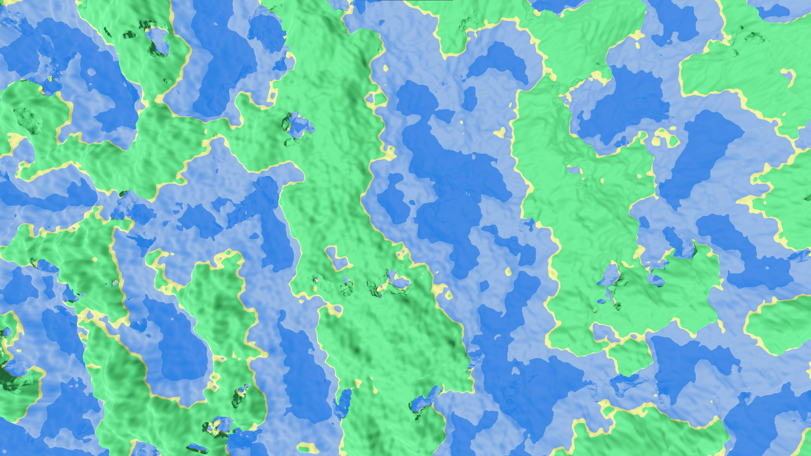
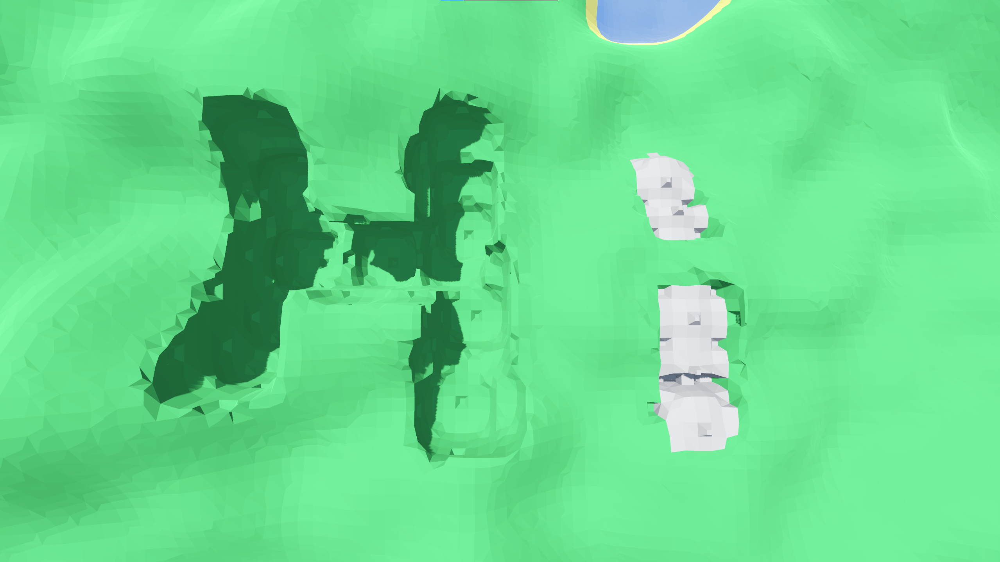

# Voxel Game Prototype

## About
This repository is a developmental snapshot of a voxel game I am working on. You can download a build of this game [here](https://bit.ly/3LpBpoB).
This project was built in Godot using C#, and demonstrates systems programming, 3D rendering, and real time generation.

## Features
- Procedural world generation using a Signed Distance Field.
- Isosurface extraction using Naive Surface Nets.
- Terrain editing by altering the voxel data and remeshing.
- Multithreading and view distance adjustments to control performance.

---

## Future Plans

- Adding a LOD system to generate far off terrain at less performance cost.
- Morphing 6 regions of terrain onto a sphere to create planets.
- Adding a local block grid to create more intuitive structures.
